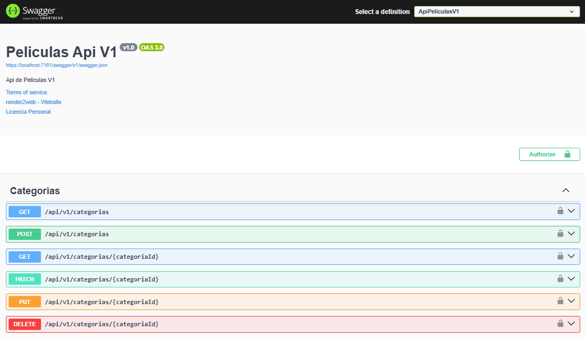

# ApiPelicula
Desarrollo de una API REST para gestión de usuarios y películas.

## Requisitos	

-Desarrollado en ASP .NET Core 8
-Base de datos SQL Server Express

Deependencias:

-AutoMapper (13.0.1)
-Microsoft.EntityFrameworkCore (8.0.4) 
-Microsoft.EntityFrameworkCore.SqlServer (8.0.4)
-Microsoft.EntityFrameworkCore.Tools (8.0.4)
-Microsoft.AspNetCore.Authentication.JwtBearer (8.0.4)
-Microsoft.AspNetCore.Identity.EntityFrameworkCore (8.0.4)
-Asp.Versioning.MVC.ApiExplorer (8.1.0)
-Asp.Versioning.MVC (8.1.0)
-Swashbuckle.AspNetCore (6.6.2)
-XAct.Core.PCL(0.0.5014)

## Configuración

1. appSettings.json: Crear ese archivo y configurarlo así

```bash
{
    "ApiSettings": {
        "Secreta": "ClaveLargaConMasDe70Caracteres*"
    },
    "ConnectionStrings": {
        "ConexionSql": "Server=localhost\\SQLEXPRESS;Database=[NOMBRE_DB];User ID=[UsuarioDB];Password=[CONTRASEÑA];Trusted_Connection=true; TrustServerCertificate=true; MultipleActiveResultSets=true"
    },
    "Logging": {
        "LogLevel": {
            "Default": "Information",
            "Microsoft.AspNetCore": "Warning"
        }
    },
    "AllowedHosts": "*"
}

```

2. Se descargan las dependencias descritas anteriormente en el Administrador de paquetes de NuGet.

3. Se ejecutan las migraciones desde "Herramientas -> "Administrador de paquetes de NuGet" -> "Consola del Administrador de paquetes", y ejecutar el comando:

```bash
update-database
```

4. Se ejecuta la API para probar los endpoints desde el Swagger.

